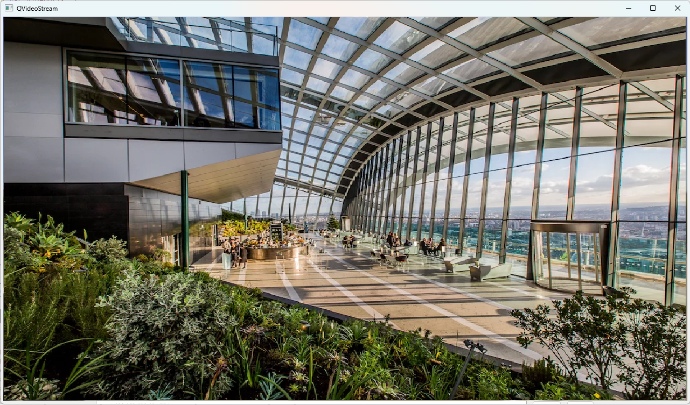

# QVideoStream

**QVideoStream** is a lightweight, high-performance video streaming library written in C++ for Qt. It leverages FFmpeg and `QSGTextureProvider` to deliver real-time video rendering directly in QML. Whether you're streaming from RTSP cameras, reading local files, or capturing webcam input, QVideoStream provides a smooth and efficient solution.

## ✨ Features

- ✅ Real-time video playback (RTSP/local/webcam)
- 🚀 Hardware (GPU) and software (CPU) decoding
- 🧩 Easy integration with QML via `VideoStream` item
- 🔁 Based on `QQuickFramebufferObject` and `QSGTextureProvider`
- 📦 Minimal dependencies — just Qt and FFmpeg

## 📷 Screenshot



## 📦 Requirements

- Qt 5/6+ with QML/QtQuick support
- FFmpeg (included or linked)
- Support for `QQuickFramebufferObject`

## 🚀 Getting Started

### C++ Registration (main.cpp)
```cpp
qmlRegisterType<VideoRendererItem>("VideoStream", 1, 0, "VideoStream");
```

### QML Example
```qml
import QtQuick
import QtQuick.Controls
import VideoStream 1.0

ApplicationWindow {
    visible: true
    width: 1280
    height: 720

    VideoStream {
        id: player
        anchors.fill: parent
        url: "rtsp://your_stream_url"
        forceCpuMode: false
    }

    Button {
        text: "Play"
        onClicked: player.play()
    }

    Button {
        text: "Stop"
        anchors.right: parent.right
        onClicked: player.stop()
    }
}
```

## ⚙️ Build Instructions

1. Clone the repository and add the `qvideostream/` sources to your Qt project.
2. Register `VideoRendererItem` in your `main.cpp` file.
3. Add the `ffmpeg` binaries if not already linked dynamically.
4. Compile and run your Qt application.

## 🧠 How it Works

- `VideoDecoder` (C++ thread) uses FFmpeg to extract frames.
- Decoded RGB frames are emitted as Qt signals.
- `VideoRendererItem` receives and renders them with `QSGSimpleTextureNode`.

## 📄 License

This project is licensed under the MIT License. See the [LICENSE](LICENSE) file for details.